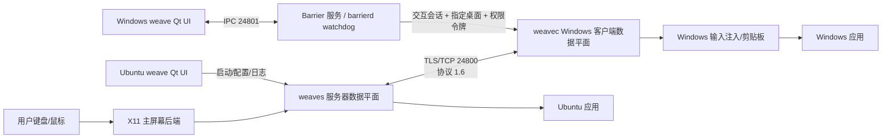
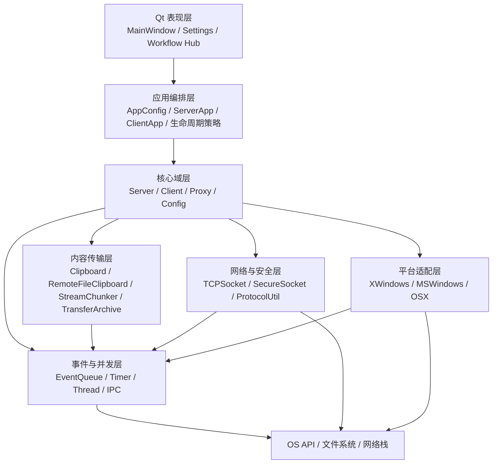
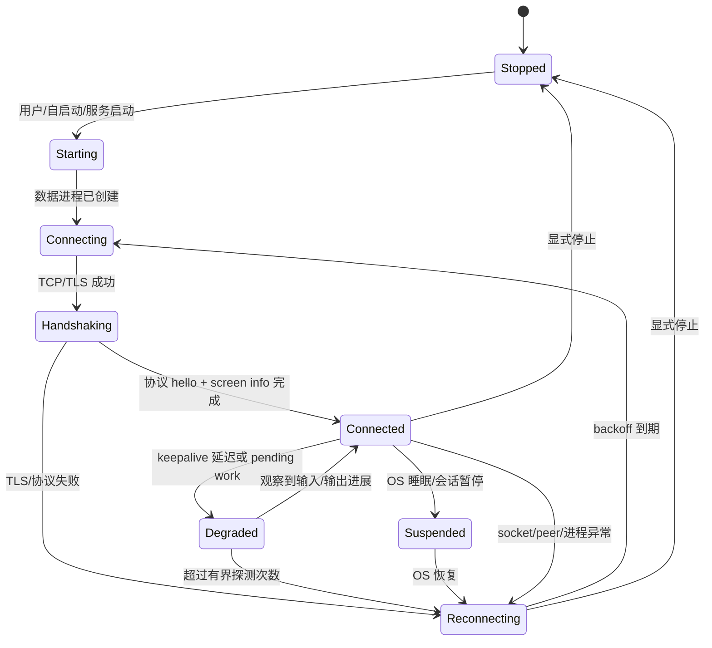
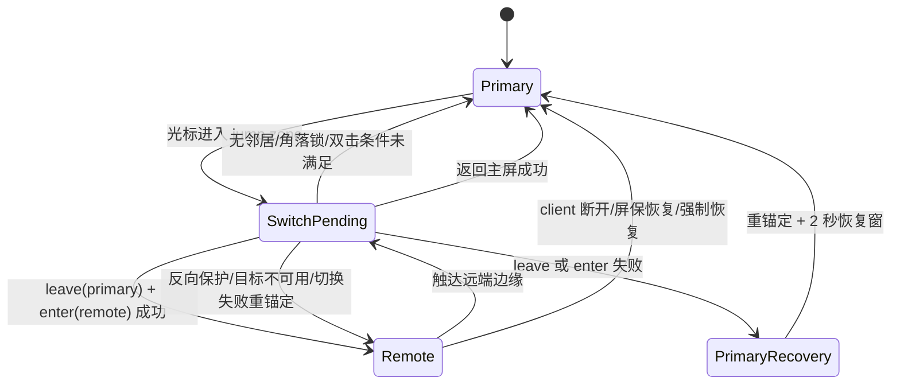
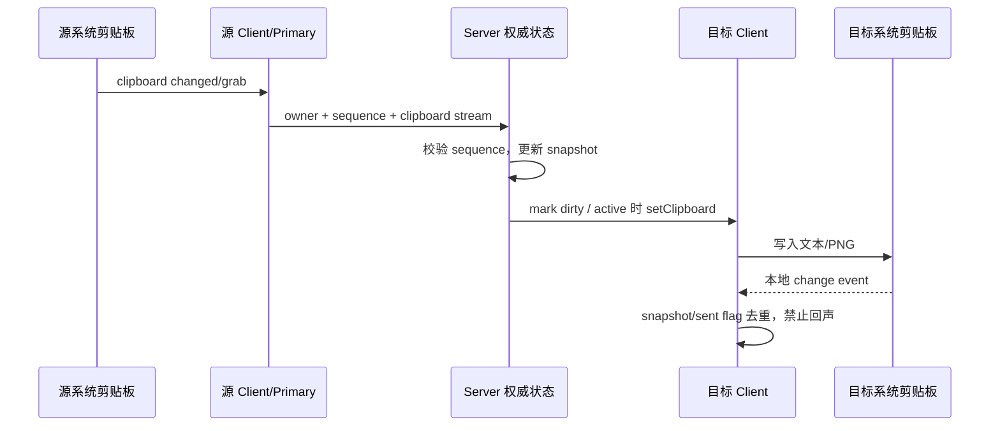
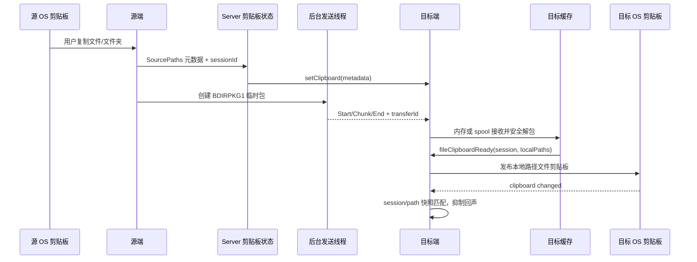
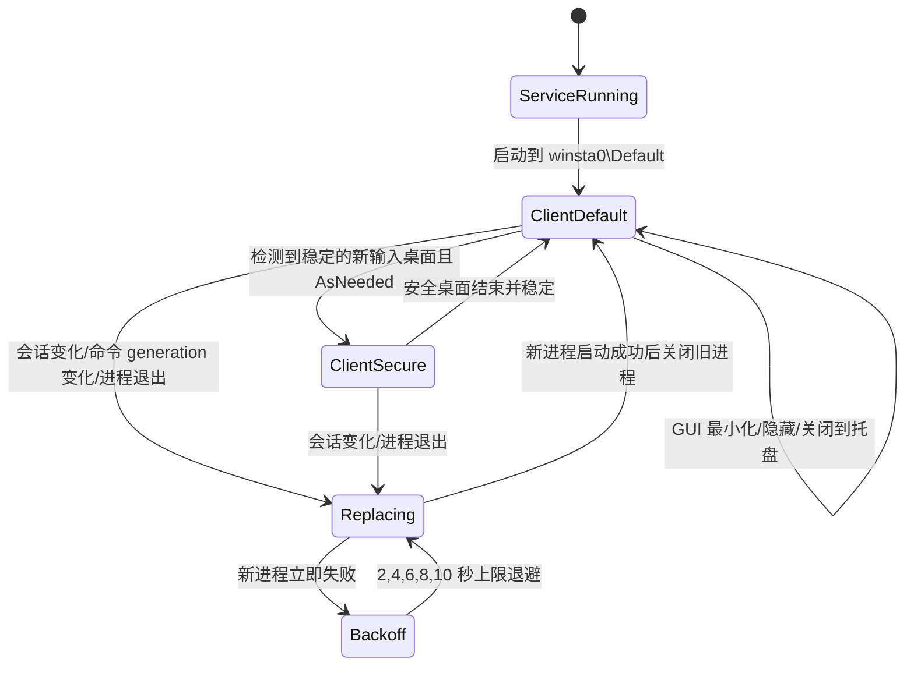

# Weave 系统架构与详细设计审查基线

> 文档版本：2026-07-14 / Draft 1
>
> 代码分支：`codex/weave-stability-optimization`
>
> 基线提交：`6862b4b5`（本文同时覆盖该提交之后尚未提交的工作树改动）
>
> 审查对象：Ubuntu 主控端 + Windows 被控端，兼顾 macOS 和后续多节点扩展
>
> 文档目的：向独立审查者完整说明当前实现、设计约束、验证证据、目标方案和剩余风险

## 0. 审查说明

### 0.1 状态标记

本文使用以下标记，避免把“目标”误认为“已经完成”：

| 标记 | 含义 |
|---|---|
| **[I] 已实现** | 当前工作树已有对应代码，但不代表所有平台均完成实机验证 |
| **[V] 已验证** | 已有自动化测试或 Ubuntu/Windows 双机实测证据 |
| **[T] 目标设计** | 建议的下一阶段设计或量化目标，当前未必实现 |
| **[R] 风险/缺口** | 已知限制、待确认问题或验证覆盖不足 |

### 0.2 给外部审查模型的建议审查任务

请重点检查：

1. 事件循环是否仍存在被剪贴板提供者、文件线程回收或平台 API 阻塞的路径。
2. 输入路由状态机是否在所有失败分支保持“鼠标必定属于某一台屏幕”的不变量。
3. 文件剪贴板的元数据、包数据、会话 ID 和本地发布之间是否可能竞态、串包或回声循环。
4. Windows 服务、交互会话、`Default`/安全桌面和 UIAccess 的权限模型是否真正覆盖 UAC 场景。
5. 大文件、恶意包、断线重连、缓存回收和线程销毁是否存在内存、磁盘或安全问题。
6. 本文提出的 SLO、资源预算、测试矩阵是否足以支持“可长期无人值守运行”的产品承诺。

### 0.3 重要结论

Weave 当前不是单一 GUI 程序，而是由 UI、数据平面进程、Windows 服务/watchdog、平台输入后端和 TLS 网络协议组成的多进程事件驱动系统。核心演进自 Barrier 1.x，但已加入文件剪贴板、传输背压、磁盘落盘、桌面切换策略、鼠标切换恢复、连接进度探测和新的 Qt 工作流界面。

当前架构方向成立，但系统稳定性的首要不变量必须是：

> **任何文件、剪贴板、日志、UI 或清理工作都不得同步阻塞输入事件循环；任何切屏失败都必须立即把光标重新锚定到当前有效屏幕。**

最近出现的“鼠标卡在屏幕中间”“文件复制后鼠标无法过去”“连接突然断开”本质上违反了这一不变量。最新修复已把文件剪贴板预取从同步等待改为后台发送，并加入文件剪贴板回声抑制和切屏失败恢复；相关双机回归已通过，但 8/24 小时长稳、真实 UAC 安全桌面和更大文件矩阵仍需继续验证。

---

## 1. 产品目标与边界

### 1.1 产品目标

Weave 的核心价值是让多台计算机表现为一个连续桌面：

- 鼠标和键盘在屏幕边缘自然跨设备切换。
- 文本、图片、文件和文件夹通过系统剪贴板跨设备使用。
- 开启 Weave 后，各设备内部原生复制、粘贴、拖放和快捷键不被破坏。
- UI 被关闭到托盘或最小化时，数据平面继续运行。
- 网络短暂中断、睡眠唤醒、长时间离开后能够自动恢复。
- Windows 权限桌面切换时尽量保持控制；无法保持时也必须快速、自恢复且不陷入重启循环。
- 默认资源占用可预测，不随运行时间、复制次数或重连次数持续增长。

### 1.2 非目标

当前版本不试图成为：

- 远程桌面视频流或音频流工具。
- 公网中继、账户云同步或跨互联网文件网盘。
- 完整的分布式文件系统。
- 无限制大小、可断点续传的传输协议。
- Wayland 原生输入注入方案；Linux 当前主要依赖 X11。
- 对 Windows 安全桌面“无条件可控制”的绕过工具；能力受 Windows 安全模型、签名和 UIAccess 规则约束。

### 1.3 用户需求追踪

| 需求 | 当前状态 | 设计响应 | 尚需完成 |
|---|---|---|---|
| 长时间运行稳定性 | **[I][R]** | 有界队列、线程延迟销毁、连接进度探测、重连、切屏恢复 | 8h/24h/72h soak 和故障注入 |
| 内存占用 | **[I][V]** | 32 MiB 接收内存阈值、磁盘 spool、有界待处理队列、缓存裁剪 | 长稳 RSS/句柄趋势与峰值矩阵 |
| 性能和延迟 | **[I][V]** | 240 Hz 鼠标合并、TCP_NODELAY、后台传输、输出背压 | P50/P95/P99 自动测量 |
| 长时间离开后快速接续 | **[I][R]** | keepalive、进度感知探测、自动重连、睡眠/恢复事件 | 睡眠、网断、路由切换长周期测试 |
| 可用性和体验 | **[I]** | 状态面板、托盘、响应式设置、工作流中心、错误日志 | 用户任务测试和可访问性审查 |
| Windows 最小化不断开 | **[I][V]** | UI 生命周期与数据进程解耦，关闭到托盘策略 | 扩展 1h/8h 最小化测试 |
| 管理员终端/UAC 不断开 | **[I][R]** | Windows 服务托管、会话令牌、桌面切换稳定/防抖、按需提权 | 真实 UAC、锁屏、切用户完整实测 |
| UI 美观流畅 | **[I][R]** | 新图标、暗色样式、紧凑状态布局、滚动设置页 | 多 DPI/主题截图对比与交互性能测量 |
| 文本互传 | **[I][V]** | 剪贴板序列、格式封送、流式分块 | 多语言/超大文本/应用兼容矩阵 |
| 图片互传 | **[I][V]** | PNG 剪贴板格式、分块、X11 PNG 转换修复 | 大图与多个 Windows 应用兼容测试 |
| 文件/文件夹互传 | **[I][V][R]** | 文件剪贴板元数据 + 包传输 + 本地物化 + 系统剪贴板发布 | Explorer 实际 Ctrl+V、大文件、多文件、断线测试 |
| 不影响本机复制粘贴 | **[I][V][R]** | 延迟读取、快照去重、回声抑制、失败不清空本地剪贴板 | 更多剪贴板提供者和高频复制压力测试 |

---

## 2. 系统上下文与部署架构

### 2.1 系统上下文



### 2.2 当前双机部署

| 节点 | 角色 | 主要进程 | 生命周期所有者 | 网络 |
|---|---|---|---|---|
| Ubuntu | 主控/服务器 | `weave` + `weaves` | Qt GUI 启动并监控 server；可由桌面自启动或外部服务托管 GUI | 监听 TLS TCP `24800` |
| Windows | 被控/客户端 | `weave.exe` + `weavec.exe` + `barrierd.exe` | Windows `Barrier` 服务中的 watchdog 托管数据进程 | 连接 Ubuntu `24800`；本机 IPC `24801` |

**[V] 当前部署证据：** Ubuntu 与 Windows 的数据连接已建立；当前 Windows 测试构建来自 `C:\Users\19684\weave-codex-20260713\build-msvc\bin\Release\weavec.exe`。该路径是开发部署路径，不是最终发行路径。

### 2.3 进程边界的设计理由

1. **GUI 不是数据平面。** UI 最小化、隐藏、重绘、主题切换或崩溃不应直接断开输入连接。
2. **Windows 服务不是输入注入进程。** 服务运行在 Session 0；真正的客户端必须被启动到当前交互用户会话和正确输入桌面。
3. **服务器是输入路由权威。** 只有服务器持有当前活动屏幕、坐标和按键状态的最终判定。
4. **平台后端封装 OS 差异。** X11、Windows hook/clipboard 和 macOS API 不进入协议层。
5. **大数据工作必须与事件循环分离。** 打包、文件读取、写入目标目录和缓存解包在后台线程中完成。

### 2.4 目标发行部署

**[T]** 正式版本应满足：

- Windows 安装目录固定、版本可查询，不依赖用户构建目录。
- GUI、daemon、client 和 hook DLL 使用同一 build ID。
- 升级以原子方式替换整个组件集合，失败可回滚。
- Windows 服务启动类型为自动（延迟启动），崩溃恢复策略明确。
- Ubuntu 提供稳定的 user service，UI 与 server 可独立重启。
- UI “关于/诊断”页显示版本、协议、进程 PID、二进制路径、服务状态和对端 build ID。

---

## 3. 软件架构设计

### 3.1 分层架构



### 3.2 模块职责

| 模块 | 责任 | 关键文件 |
|---|---|---|
| Qt GUI | 状态、配置、托盘、日志、工作流、启动/停止 | `src/gui/src/MainWindow.*`, `SettingsDialog.*` |
| UI 配置 | 持久化进程模式、TLS、性能、工作流、窗口设置 | `src/gui/src/AppConfig.*` |
| 窗口策略 | 将“关闭/最小化”转换为隐藏、最小化或退出 | `src/gui/src/WindowLifecyclePolicy.*` |
| 服务编排 | 参数解析、监听/连接、重连、IPC、进程退出 | `src/lib/barrier/ServerApp.*`, `ClientApp.*` |
| 服务器域 | 屏幕拓扑、输入路由、剪贴板所有权、文件路由 | `src/lib/server/Server.*` |
| 客户端域 | 握手、输入注入、剪贴板发布、接收/发送文件 | `src/lib/client/Client.*` |
| 协议适配 | 1.0-1.6 版本兼容和消息编解码 | `ClientProxy1_0...1_6`, `ServerProxy.*` |
| 内容格式 | 文本/PNG/文件元数据、包创建与解包 | `Clipboard.*`, `RemoteFileClipboard.*`, `TransferArchive.*` |
| 流式传输 | 分块、背压、取消、keepalive 维护事件 | `StreamChunker.*`, `FileChunk.*`, `ClipboardChunk.*` |
| 网络安全 | TCP、TLS 握手、证书指纹、超时 | `TCPSocket.*`, `SecureSocket.*` |
| 事件并发 | 主事件队列、计时器、线程、取消与唤醒 | `EventQueue.*`, `Thread.*` |
| Windows 权限 | daemon、会话令牌、输入桌面、watchdog | `MSWindowsWatchdog.*`, `ElevationPolicy.*`, `DesktopSwitchPolicy.*` |
| 平台后端 | 原生输入捕获/注入、剪贴板、屏幕坐标 | `src/lib/platform/*` |

### 3.3 依赖规则

1. 平台代码不能直接决定跨屏拓扑；只上报屏幕形状和输入事件。
2. UI 不能直接持有网络 socket；只能通过进程编排和 IPC 控制数据平面。
3. `Server`/`Client` 不直接操作 Qt 控件。
4. 协议消息必须先经过长度和状态验证，再改变域状态。
5. 后台线程不得直接改变活动屏幕、剪贴板所有者或 proxy 容器；只能投递事件回主事件循环。
6. 线程回收不得在输入热路径中无限等待。
7. 文件缓存只保存已物化的本地副本；远端源路径永远不能直接发布为本地可访问路径。

### 3.4 线程与所有权模型

| 执行上下文 | 主要工作 | 允许修改的状态 | 禁止行为 |
|---|---|---|---|
| Qt 主线程 | UI、设置、WorkflowStore | Qt 对象、UI 状态 | 阻塞等待数据进程或大文件 I/O |
| Server 事件线程 | 输入顺序、活动屏幕、client map、剪贴板权威状态 | `Server` 域状态 | 同步等待文件发送/解包线程完成 |
| Client 事件线程 | 协议状态、输入注入顺序、本地剪贴板发布 | `Client` 域状态 | 在消息回调内执行大文件复制 |
| 文件发送线程 | 打包、读取、分块投递 | 自己的 transfer generation 和 chunker | 直接访问已销毁 proxy |
| 文件落盘/解包线程 | spool 读取、目标写入、缓存物化 | 当前 `CompletedFileTransfer` | 直接发布剪贴板或改变连接状态 |
| Windows watchdog 主线程 | 监控会话/桌面/进程，替换启动 | 命令快照、generation、进程句柄 | 持锁等待子进程退出 |
| Windows watchdog 输出线程 | 读取子进程日志管道 | 日志输出器 | 操作启动状态 |

所有跨线程引用必须满足至少一种生命周期策略：

- 值复制，例如路径列表、transfer ID。
- `shared_ptr` 共享只读/可取消对象，例如 `StreamChunker`。
- 主线程拥有，后台只通过事件 target + generation 回传。
- 连接关闭时先“逻辑脱离”，待线程结束后再释放 stream/proxy。

### 3.5 事件优先级原则

**[T]** 事件队列在语义上分为三类：

1. **P0 输入顺序事件：** 切屏、鼠标按钮、按键、滚轮、活动屏幕恢复。
2. **P1 连接维护事件：** 握手、keepalive、断线、重连、screen info。
3. **P2 批量数据事件：** 文件块、剪贴板块、工作流索引、日志。

当前实现通过鼠标合并、文件队列预算和后台线程间接保证优先级，但 `EventQueue` 仍基本是统一队列。后续若压力测试显示 P2 可拖慢 P0，应引入显式多队列或公平调度，而不是继续提高超时。

---

## 4. 协议与数据设计

### 4.1 传输协议

- **[I]** 主协议版本 `1.6`。
- **[I]** 默认服务端口 `24800`。
- **[I]** 消息以 4 字节消息码区分类型。
- **[I]** `1.3` 加入 keepalive，`1.4` 加入加密，`1.5` 加入文件传输，`1.6` 加入剪贴板流式传输。
- **[I]** 普通协议消息最大 `4 MiB`，列表/字符串最大 `1 MiB`，hello 最大 `1024` 字节。
- **[I]** 文件块和剪贴板块在协议层分为 `Start / Chunk / End / Cancel`。

代码依据：`src/lib/barrier/protocol_types.h:23-68`。

### 4.2 控制平面与数据平面

| 平面 | 消息 | 时延敏感度 | 可靠性策略 |
|---|---|---|---|
| 输入控制 | enter/leave、mouse、key、wheel | 最高 | TCP 顺序 + 主事件循环严格排序 |
| 连接控制 | hello、info、keepalive、disconnect | 高 | 状态机、timer、进度探测、重连 |
| 剪贴板控制 | owner/sequence/grab、dirty、元数据 | 中 | 序列号、快照去重、重试 |
| 内容数据 | clipboard chunks、file chunks | 吞吐优先 | 分块、背压、取消、generation |
| 本地控制 | GUI ↔ daemon/client IPC | 中 | 本机端口、目标 PID、命令 generation |

### 4.3 TLS 与信任

**[I]** 网络数据通过 `SecureSocket` 使用 TLS。首次信任基于证书指纹，后续与本地信任数据库对比；握手无进展会关闭本次连接，由 `ClientApp` 负责重连。

**[R]** 当前 GUI 配置中加密默认开启，但客户端证书要求默认关闭。也就是说主要是服务端身份校验和链路加密，不等同于完整双向认证。

### 4.4 剪贴板数据模型

每个 `ClipboardID` 维护：

- `owner`：最近声明内容的屏幕名。
- `sequence`：切屏/抓取时序标识，拒绝过时写入。
- `Clipboard`：当前规范化内容。
- `ClipboardDataSnapshot`：封送后的快照，用于内容相等判断。
- `pendingPrimaryFetch`：主屏内容已变化但尚未成功读取。
- 各 client 的 dirty 标记：决定下次进入时是否需要重放。

支持的主要格式：

- 文本。
- HTML 等 Barrier 既有格式。
- PNG 图片。
- 文件剪贴板私有元数据。

### 4.5 文件剪贴板元数据

文件剪贴板不是简单发送路径字符串。远端路径在本机无意义，因此使用两阶段设计：

1. 剪贴板控制消息携带 `sessionId`、模式和源选择信息。
2. 文件数据平面发送选择内容打成的 package。
3. 接收端解包到本地 `clipboard-cache/{server|client}/{session}`。
4. 用接收端真实路径构建本地系统文件剪贴板。

元数据限制：

| 项目 | 上限 |
|---|---:|
| 路径数量 | 1024 |
| 单路径字节数 | 64 KiB |
| 路径总字节数 | 1 MiB |
| 原生文件选择数据 | 4 MiB |

代码依据：`src/lib/barrier/RemoteFileClipboard.h:15-18`。

### 4.6 选择包格式

`TransferArchive` 使用内部二进制包：

```text
magic     = "BDIRPKG1"              // 8 bytes
entry     = type + pathLen + path [+ fileSize + payload]
type      = 'D' | 'F' | 'E'          // directory, file, end
pathLen   = uint32 big-endian
fileSize  = uint64 big-endian
```

安全约束：

- 拒绝绝对路径。
- 拒绝任何 `..` 路径分量。
- 拒绝符号链接和非普通文件。
- 单个 entry 路径最大 64 KiB。
- 重名顶层项通过 `name (n).ext` 去重。
- 临时包使用安全临时文件创建接口。

**[R]** 该格式当前没有校验和、压缩、版本协商或断点续传。TLS 可保护传输完整性，但不能替代包级离线校验和可恢复性。

---

## 5. 核心逻辑设计

### 5.1 连接状态机



设计不变量：

- GUI 状态变化不能隐式进入 `Stopped`。
- 每次连接尝试只有一个 owner；旧 stream/proxy 可延迟释放，但不再接收新域事件。
- 重连后重新交换 screen info、按键状态和剪贴板 dirty 状态，不能复用过期输入序列。
- 显式停止和故障重连必须可区分，防止 UI 自动重启用户主动停止的进程。

### 5.2 活动屏幕状态机



全局不变量：

1. `m_active` 始终指向一个已连接且形状有效的屏幕。
2. `(m_x, m_y)` 始终被 clamp 到 `m_active` 的有效形状内。
3. `leave()` 成功前不得切换 `m_active`。
4. 失败后立即丢弃待发送鼠标位置并在当前屏幕调用 `mouseMove()` 重锚定。
5. 切屏前 flush 已合并鼠标移动，切屏后清零 delta，避免旧坐标落到新屏。
6. 主屏离开失败后 2 秒内禁止再次离开，避免边缘重试风暴。

### 5.3 普通文本/图片剪贴板流程



关键规则：

- 剪贴板读取失败时保留 `pending`，通过定时重试而不是清空内容。
- 内容封送快照相同则不重复广播。
- 写入远端内容后设置本地 sent/snapshot 标志，过滤平台产生的回调。
- 主屏 X11 普通 clipboard 在离开前额外 snapshot，因为首次本地复制可能没有 `SelectionClear`。
- `PRIMARY` selection 仍保持事件驱动，避免每次切屏读取造成延迟。

### 5.4 文件剪贴板流程



核心不变量：

- 元数据和 package 使用同一个 `sessionId` 绑定。
- `transferId`/generation 不匹配的 chunk 必须丢弃。
- 目标 client 已断开时不得继续向旧 proxy 发送。
- 物化成功前不发布文件剪贴板；失败时不污染现有本地剪贴板。
- 物化后的本地路径只允许一次回声抑制；下一次用户真正复制同一路径仍应可传播。
- 文件预取是非阻塞的，不因切屏而同步 cancel/wait。

### 5.5 拖放与文件剪贴板的关系

两者复用文件分块和落盘基础设施，但语义不同：

| 语义 | 触发 | 目标 | 完成表现 |
|---|---|---|---|
| 跨屏拖放 | OS drag start + 切屏 | 目标 drop directory | 直接写文件，并可把结果路径发布到剪贴板 |
| 文件剪贴板 | Ctrl+C/复制 | 目标 clipboard cache | 目标 Explorer/文件管理器执行粘贴时再使用 |

设计上不能把二者完全混为一个状态：拖放有 drop target 和 drag file list，文件剪贴板有 session、metadata 和本地发布阶段。

### 5.6 Windows UI/服务/客户端生命周期



窗口规则：

- 显式“退出”才停止 GUI/数据平面。
- 普通关闭：有托盘则隐藏，无托盘则最小化。
- 开启 minimize-to-tray 时，最小化事件只隐藏窗口，不停止进程。
- 最小化测试必须同时确认 GUI PID、client PID、`24800` 远端连接和 `24801` IPC 连接仍存在。

权限规则：

| 模式 | Default 桌面 | 非 Default/安全桌面 | 桌面变化重启 |
|---|---|---|---|
| AsNeeded | 普通交互令牌 | 自动尝试提升/UIAccess | 是 |
| Always | 始终使用提升令牌 | 始终提升 | 否，依赖高权限进程跨桌面能力 |
| Never | 不提升 | 不自动提升 | 否 |

桌面观测策略：

- 新桌面先等待 `0.25 s` 稳定，再次读取确认。
- 两次 relaunch 至少间隔 `2.0 s`。
- 服务无法读取活动桌面时可退回 `Default`，防止永久无法启动。
- 启动新进程成功并存活 1 秒后才关闭旧进程，降低替换窗口。
- `commandGeneration` 防止旧启动完成后覆盖新命令状态。

---

## 6. 算法设计

### 6.1 屏幕边缘坐标映射

对水平切换，使用纵轴归一化；对垂直切换，使用横轴归一化：

```text
t = clamp01((p - sourceOrigin + 0.5) / sourceLength)
targetP = clamp(floor(t * targetLength) + targetOrigin,
                targetOrigin,
                targetOrigin + targetLength - 1)
```

然后：

1. 按配置拓扑查找该方向邻居。
2. 若直接邻居未连接，沿同方向继续查找可用屏幕。
3. 目标形状小于 `64 x 64` 时视为不可用。
4. 进入目标后向内缩进：

```text
z = max(targetJumpZone,
        min(16, max(1, min(targetWidth, targetHeight) / 8)))
```

5. 只有目标对侧确实存在邻居时才强制 inward inset，避免不必要地改变落点。

代码依据：`src/lib/server/Server.cpp:1154-1374`。

### 6.2 防止“左边进去、右边立刻出来”

**最近反向切换保护算法：**

```text
on successful A -> B through direction d:
    guard = {
        from: A,
        to: B,
        reverse: opposite(d),
        entry: currentPoint,
        startedAt: now
    }

on B edge attempt toward A:
    if now - startedAt <= 2s and direction == reverse:
        suppress switch

on cursor moving 96px away from entry edge:
    clear guard
```

这解决尺寸不一致、入口仍处于 jump zone、平台 warp 事件回流导致的瞬时反弹。最大 2 秒是防故障上限；正常情况下移动 96 px 后即清除。

### 6.3 切屏失败恢复

```text
attemptSwitch(dst):
    validate dst and shape
    flush coalesced mouse move
    save old active/position

    if old.leave() fails:
        restore old position and deltas
        if old is primary:
            safeMargin = max(jumpZone + 8, 16)
            if point remains near any edge:
                point = screenCenter
            warp cursor to point
            refresh key state
            block new primary leave for 2s
        return false

    enter dst
    return true
```

任何目标映射失败、形状无效或 enter 前失败，都调用 `reanchorActiveAfterFailedSwitch()` 把坐标 clamp 回当前活动屏幕并实际 warp，避免逻辑坐标与可见光标同时丢失。

### 6.4 鼠标移动合并

目标是限制网络和事件开销，同时保持按钮/滚轮/切屏顺序：

```text
interval = 1 / 240 second

queueMouseMove(target, x, y):
    if target changed:
        flush pending move
    if no move sent or elapsed >= interval:
        send immediately
    else:
        replace pending point with newest (x, y)
        arm one-shot timer for remaining interval

before key/button/wheel/switch/disconnect:
    flush pending move
```

该算法不是简单丢弃中间点，而是保留每个窗口内的最后位置，保证最终坐标正确；所有有顺序语义的输入前必须 flush。

代码依据：`src/lib/server/Server.cpp:73`, `3112-3159`。

### 6.5 Keepalive 与进度感知断线判定

基础参数：

- keepalive 发送间隔默认 `3 s`。
- 初始死亡告警窗口为 `5` 个 keepalive，即 `15 s`。
- 告警时不立即断开，而是先检查 stream 输入就绪和 buffered output。
- 无 pending work 时最多额外主动探测 3 次。
- 有 pending work 时，如果输入出现或输出缓冲下降，重置计数；若完全无进展，最多 defer 8 次后断开。

伪代码：

```text
onAlarm:
    pendingInput = stream.isReady()
    buffered = stream.bufferedOutputSize()

    if pendingInput newly appeared or buffered decreased:
        reset deferral and missed counters

    if pendingInput or buffered > 0:
        if deferrals >= 8:
            disconnect("pending work made no progress")
        else:
            deferrals++
            reset alarm
        return

    if last protocol activity is newer than alarm window:
        reset alarm
        return

    if missedProbes < 3:
        send keepalive/info query
        missedProbes++
        reset alarm
    else:
        disconnect("peer not responding")
```

设计目的不是无限容忍阻塞，而是区分“正在传输但 keepalive 排队”和“socket 完全停止进展”。

### 6.6 重连与进程重启

分为两层：

- **网络层重连：** `ClientApp` 在连接结束后重新进入 connect 流程；TLS/握手失败仅淘汰当前 attempt。
- **进程层重启：** GUI 或 Windows watchdog 发现进程退出后，以有上限退避重启。

**[T] 推荐统一退避公式：**

```text
delay = min(maxDelay, base * 2^attempt) + uniform(0, jitter)
```

当前 Windows watchdog 使用近似线性 `min(failures * 2, 10s)`；为了避免多节点同步重连风暴，正式多节点版本应加入 jitter，并在连接稳定一段时间后清零 attempt。

### 6.7 剪贴板读取重试与一致性

剪贴板经常被源应用短暂锁定。正确逻辑是：

```text
on clipboard owner/sequence change:
    mark dirty/pending
    attempt open/read
    if busy:
        keep previous snapshot and owner intent
        schedule bounded retry
    if success:
        normalize formats
        marshal snapshot
        if same as previous:
            clear pending without broadcast
        else:
            commit snapshot, owner, sequence
            mark all non-sender clients dirty
```

**关键决定：读取失败绝不能等价于“剪贴板为空”。** 否则会破坏源设备本机粘贴并向其他节点广播空数据。

### 6.8 文件传输分块和背压

文件 chunk 大小按总大小自适应：

| 总大小 | chunk |
|---:|---:|
| `< 4 MiB` | 32 KiB |
| `4-32 MiB` | 64 KiB |
| `32-256 MiB` | 128 KiB |
| `>= 256 MiB` | 256 KiB |

剪贴板 chunk：

| 总大小 | chunk |
|---:|---:|
| `< 1 MiB` | 8 KiB |
| `1-16 MiB` | 16 KiB |
| `>= 16 MiB` | 32 KiB |

背压预算：

- 文件 queued payload 预算约 `4 MiB`。
- 文件 socket buffered output 预算 `256 KiB`。
- 剪贴板 socket buffered output 预算 `128 KiB`。
- 每累计一定字节主动 cooperative yield。
- 等待期间持续检查 cancel 和 transfer generation。
- 传输线程投递 maintenance event，避免长数据流被误判为无活动。

代码依据：`src/lib/barrier/StreamChunker.cpp:32-104`。

### 6.9 接收内存与磁盘 spool

```text
if expectedSize > 512 MiB:
    reject
else if expectedSize > 32 MiB:
    receive into secure .part spool file
else:
    receive in memory

for each chunk:
    require received + chunk <= expectedSize

on End:
    require received == expectedSize

on Cancel/Error:
    clear String capacity and delete spool
```

另外：

- 同时待写入的完成传输最多 4 个。
- 内存态待处理传输总预算 32 MiB。
- 超预算时明确拒绝/丢弃并记录日志，不允许无界增长。

代码依据：`src/lib/barrier/FileChunk.cpp:28-190`, `src/lib/server/Server.cpp:73-75,3273-3310`。

### 6.10 文件缓存裁剪

接收端物化缓存按 session 隔离。当前裁剪策略保留当前 session，并限制历史：

- 最多约 8 个 session。
- 总缓存预算 `512 MiB`。
- 先删除非当前、较旧的 session。

**[R]** 缓存裁剪需要验证进程崩溃、文件被 Explorer 占用和多用户 profile 情况；删除失败必须可重试且不能阻塞输入线程。

### 6.11 文件剪贴板回声抑制

回声来源：接收端物化 package 后把本地路径写入系统剪贴板，平台随后把它报告为一次“新的本地复制”。若不抑制，内容会被重新打包发送回源端，阻塞输出并形成环。

当前算法：

```text
after materialization:
    readySession = sessionId
    readyPaths = normalized(localPaths)

when primary clipboard is sampled:
    if clipboard mode == SourcePaths
       and normalized(paths) == readyPaths:
        accept as local snapshot only
        clear readySession/readyPaths
        do not claim new ownership
        do not start package transfer
```

采用路径集合匹配而不是仅匹配 session，是因为原生 Windows/X11 文件剪贴板往返后未必保留私有 session 格式。

### 6.12 Windows 桌面切换判定

```text
observe(last, current, now):
    if current empty:
        no action
    if last empty:
        remember current
    if current == last:
        clear pending
    if pending != current:
        pending = current
        pendingSince = now
        wait 250ms
    if now - pendingSince < 250ms:
        wait
    if now - lastRelaunch < 2s:
        debounce
    else:
        relaunch on current desktop
```

进程替换使用“先启动新进程、确认仍存活、再关闭旧进程”的顺序；停止旧 hook 进程优先使用 IPC 优雅退出，超时才 `TerminateProcess`，因为强杀可能把 hook DLL 留在应用进程内。

---

## 7. 决策设计（ADR 汇总）

### ADR-001：保留事件驱动核心，而非重写为同步 RPC

- **状态：** **[I] 接受**
- **背景：** 输入事件需要严格顺序、低开销和跨平台计时器。
- **决定：** 继续以 `EventQueue` 为域状态唯一串行化入口。
- **拒绝方案：** 为每个输入调用阻塞 RPC；会放大网络抖动并破坏顺序。
- **代价：** 必须严控任何事件 handler 内的阻塞调用，线程完成需事件化。

### ADR-002：GUI 与数据平面分离

- **状态：** **[I][V] 接受**
- **背景：** UI 最小化、隐藏或重绘不应影响连接。
- **决定：** GUI 只负责编排，`weaves/weavec` 持有连接。
- **拒绝方案：** 把 socket 和输入 hook 全放进 Qt GUI；窗口生命周期会变成连接生命周期。
- **代价：** 需要 IPC、进程状态同步和更清楚的诊断信息。

### ADR-003：Windows 由服务 watchdog 托管客户端

- **状态：** **[I][R] 接受**
- **背景：** 普通桌面、管理员程序、安全桌面和交互会话具有不同权限。
- **决定：** 服务监控会话和输入桌面，在 `winsta0\desktop` 上用用户令牌启动客户端。
- **拒绝方案：** 仅使用启动项中的普通用户进程；无法可靠控制高完整性窗口。
- **代价：** UIAccess、签名、安装路径和 Windows 安全策略仍会限制能力。

### ADR-004：TLS + 指纹信任

- **状态：** **[I] 接受**
- **背景：** 输入和剪贴板均为高敏感数据。
- **决定：** 默认 TLS，首次显式确认指纹，后续固定信任。
- **拒绝方案：** 明文局域网协议；无法接受被动窃听和主动注入风险。
- **代价：** 证书轮换和首次连接 UX 需要明确设计。

### ADR-005：切屏热路径禁止同步文件线程回收

- **状态：** **[I][V] 接受**
- **背景：** 旧实现的剪贴板 replay 会 wait/cancel 发送线程 2-9 秒，阻塞鼠标和 keepalive。
- **决定：** 文件剪贴板预取后台运行；切屏只建立状态和投递工作。
- **拒绝方案：** 切屏前强制等待数据清空；可保证简单生命周期，但直接破坏输入延迟。
- **代价：** 需要 generation、目标存活检查和延迟资源释放。

### ADR-006：文件剪贴板采用“元数据 + package + 本地物化”

- **状态：** **[I][V] 接受**
- **背景：** 源设备路径对目标设备不可访问。
- **决定：** 先同步选择语义，再传包并发布目标本地路径。
- **拒绝方案：** 直接发送路径；目标粘贴必然失败。共享 SMB 路径；引入外部依赖和权限复杂度。
- **代价：** 复制时即产生网络/磁盘成本，需缓存治理。

### ADR-007：文件接收超过 32 MiB 转磁盘

- **状态：** **[I] 接受**
- **背景：** 内存接收会导致大文件时 RSS 峰值和复制扩容。
- **决定：** `>32 MiB` 使用安全 spool，单次最大 `512 MiB`。
- **拒绝方案：** 全内存；简单但不可控。全部落盘；小文件延迟和磁盘写放大较高。
- **代价：** 需要临时文件清理和磁盘空间错误处理。

### ADR-008：鼠标移动以 240 Hz latest-value 合并

- **状态：** **[I] 接受**
- **背景：** 高轮询鼠标可产生数千事件/秒。
- **决定：** 每 4.17 ms 窗口发送最后坐标；有顺序语义的事件前 flush。
- **拒绝方案：** 全量发送；事件/网络开销高。60 Hz；高刷新屏明显迟滞。
- **代价：** 需要严格验证按钮和切屏前的 flush 覆盖。

### ADR-009：进度感知 keepalive，而非单纯延长超时

- **状态：** **[I] 接受**
- **背景：** 大传输和安全桌面会延迟事件，但不一定代表连接死亡。
- **决定：** 结合 pending input、buffered output 下降、最近协议活动和有限探测。
- **拒绝方案：** 把超时改成数分钟；故障恢复过慢且掩盖真正死锁。
- **代价：** 状态更复杂，需对“有 pending 但无进展”设硬上限。

### ADR-010：本地复制粘贴优先于跨机同步

- **状态：** **[I] 接受**
- **背景：** Weave 是增强层，不能破坏设备原生使用。
- **决定：** 读取失败保留本地状态；远端物化失败不清空本地剪贴板；回声只抑制网络传播。
- **拒绝方案：** 每次远端失败时清空/重置 clipboard；会直接损害本机工作。
- **代价：** 允许远端短暂落后，需要 UI 显示“未同步”而不是伪装成功。

### ADR-011：关闭窗口默认隐藏/最小化，显式退出才停服务

- **状态：** **[I][V] 接受**
- **背景：** 用户将关闭按钮理解为收起常驻工具。
- **决定：** 有托盘则隐藏，无托盘则最小化；菜单中的退出才结束。
- **拒绝方案：** closeEvent 总是退出；会复现最小化/关闭后断线。
- **代价：** 必须提供清晰托盘状态和退出入口。

### ADR-012：工作流中心是可选的本地索引，不是核心传输依赖

- **状态：** **[I] 接受**
- **背景：** 历史、建议和回执提升体验，但不能影响输入和剪贴板传输稳定性。
- **决定：** 默认关闭 Workflow；启用后在 Qt 线程观察本地剪贴板并维护有界索引。
- **拒绝方案：** 将传输成功依赖于 WorkflowStore；会扩大故障域。
- **代价：** 核心日志与工作流回执目前通过日志模式匹配耦合，后续应改为结构化事件。

---

## 8. 功能设计

### 8.1 输入共享

| 功能 | 行为 | 失败反馈 | 状态 |
|---|---|---|---|
| 鼠标跨屏 | 按配置边缘和坐标比例进入邻屏 | 留在当前屏并重锚定 | **[I][V]** |
| 键盘共享 | 活动远端接收 key down/up/repeat | 断开/切回时 fake all keys up | **[I]** |
| 滚轮/横向滚轮 | 按协议 1.3+ 转发 | flush 鼠标后发送 | **[I]** |
| 相对移动 | 协议 1.2+，适配锁定鼠标场景 | game mode/relative mode 设置 | **[I]** |
| 双击边缘切换 | 可配置防误触 | 超时后重置 | **[I]** |
| 屏幕角落锁 | 指定角落不切屏 | 保持本地输入 | **[I]** |

### 8.2 内容共享

| 内容 | 源检测 | 网络表示 | 目标发布 | 状态 |
|---|---|---|---|---|
| 文本 | OS clipboard text | marshalled clipboard/chunks | 原生文本剪贴板 | **[I][V]** |
| 图片 | PNG 或平台图片格式 | 规范化 PNG/chunks | 原生图片剪贴板 | **[I][V]** |
| URL | 文本/URI list | 剪贴板格式 | URI/text | **[I]** |
| 文件 | 原生 file selection | metadata + package | 目标缓存路径 file clipboard | **[I][V][R]** |
| 文件夹 | 原生 file selection | BDIRPKG1 递归 package | 目标缓存目录 | **[I][V][R]** |
| 拖放 | drag state + file list | drag info + file chunks | drop target | **[I][R]** |

### 8.3 连接与运维

- 自动启动/停止/重启数据进程。
- 自动或手动服务端发现。
- TLS 指纹确认。
- 日志等级和文件输出。
- GUI 托盘状态与通知。
- 服务模式/桌面模式切换。
- Windows 提权模式选择。
- 游戏模式、低延迟模式、嵌套远程模式。
- 配置热更新后受控重启。

### 8.4 Workflow Hub

**[I]** 可选工作流层包括：

- History：文本、链接、图片、文件/目录引用历史。
- Suggestions：打开链接、打开文件、在目录中显示、保存到 inbox 等建议。
- Receipts：从结构化动作或核心日志推断的成功/失败回执。
- Screenshot：捕获图片并保存预览。
- ActionBus：统一执行动作并要求敏感操作确认。
- Runtime mode：`Dormant / Active / Burst`。

资源限制：

- metadata 预算 8 MiB。
- preview 最多 20 个，总预算 12 MiB。
- suggestion 最多 40。
- receipt 最多 60。
- Burst 持续 15 秒。
- 文本 payload 默认 7 天过期，文件引用默认 14 天；当前裁剪主要按数量/预算，过期资产治理仍需加强。

**[R]** 工作流回执目前会解析核心日志文本，例如 `remote clipboard package materialized`。日志字符串不是稳定 API，应改为结构化 IPC 事件。

---

## 9. 稳定性与恢复设计

### 9.1 稳定性不变量

1. 输入事件循环单次 handler 不执行不可控时长操作。
2. 每个后台任务都有 cancel、完成、异常和 owner 消失路径。
3. 每个队列和缓存都有数量或字节上限。
4. 连接关闭后旧 generation 的事件只能被丢弃，不能作用于新连接。
5. 任一切屏失败后，用户必须在当前屏幕看到并控制光标。
6. 任一剪贴板同步失败不应破坏本地原生剪贴板。
7. UI 生命周期不拥有数据连接生命周期。
8. watchdog relaunch 必须有稳定窗口、debounce 和退避。

### 9.2 故障模式与恢复

| 故障 | 检测 | 当前恢复 | 应呈现给用户 |
|---|---|---|---|
| TCP 断开 | read/write error | 清理当前连接并重连 | “正在重新连接”，保留配置 |
| TLS 握手卡住 | 握手进度超时 | 关闭 attempt，重连 | 指纹/证书错误需区分 |
| peer 假死 | keepalive + progress | 探测后断开重连 | 连接降级时间和原因 |
| client 进程退出 | GUI/watchdog 进程监控 | 退避重启 | 重启次数、最后退出码 |
| Windows 桌面切换 | active input desktop 变化 | 稳定确认后替换进程 | 权限状态图标，不弹阻塞对话框 |
| 目标屏幕断开 | client removal | 强制恢复 primary | 光标立即回主屏 |
| `leave()` 失败 | 返回 false | 主屏安全点重锚定、2s 冷却 | 日志一次，不刷屏 |
| 文件发送目标消失 | proxy/generation 检查 | 丢弃 stale chunk，延迟清理 | 传输失败回执 |
| 接收超过 512 MiB | Start size validation | 拒绝并清理 | “超过当前 512 MiB 单次上限” |
| spool 创建/写入失败 | 文件 API 返回 | cancel/清理 | 磁盘空间/权限错误 |
| package 路径穿越 | 解包路径验证 | 拒绝整个包 | 安全错误，不发布 clipboard |
| clipboard 被占用 | open/read 失败 | 保留 pending，定时重试 | 通常静默，持续失败再提示 |
| 缓存删除失败 | filesystem error | 跳过/后续重试 | 诊断页显示缓存占用 |

### 9.3 长稳测试设计

**[T] 必须新增统一 soak harness：**

| 场景 | 时长/次数 | 成功条件 |
|---|---:|---|
| 空闲连接 | 24h、72h | 零非预期断开；RSS/句柄无单调增长 |
| 鼠标来回切屏 | 100,000 次 | 零光标丢失；零反向穿越；P99 延迟达标 |
| 文本/图片交替复制 | 10,000 次 | 最终内容一致；本机复制始终可用 |
| 1 KiB-512 MiB 文件矩阵 | 每档 20 次 | hash 一致；失败可恢复；缓存受限 |
| 网络中断 | 1s/5s/30s/5min 各 100 次 | 自动重连；无僵尸进程/重复连接 |
| Windows 最小化 | 8h | GUI/client/IPC/TCP 持续存在 |
| UAC prompt | 500 次 | 不陷入 relaunch loop；恢复后输入可用 |
| 锁屏/解锁 | 200 次 | 解锁后自动恢复，无按键卡住 |
| 睡眠/唤醒 | 100 次 | 30 秒内恢复，旧 socket 清理 |
| 服务重启/UI 崩溃 | 各 100 次 | 数据平面行为符合所有权设计 |

---

## 10. 性能与延迟优化设计

### 10.1 性能预算

以下为 **[T] 产品 SLO**，不是当前完整测量结果：

| 指标 | 目标 |
|---|---:|
| 同一局域网鼠标事件端到端 P50 | `<= 4 ms` |
| 同一局域网鼠标事件端到端 P95 | `<= 8 ms` |
| 同一局域网鼠标事件端到端 P99 | `<= 16 ms` |
| 边缘切屏到目标可见 P95 | `<= 35 ms` |
| 普通文本剪贴板可粘贴 P95 | `<= 300 ms` |
| 5 MiB 图片可粘贴 P95 | `<= 1.5 s` |
| 断网恢复后重新可控 | 网络恢复后 `<= 5 s`，最坏 `<= 15 s` |
| 输入热路径单 handler | P99 `<= 1 ms`，不得出现秒级等待 |

### 10.2 当前已实现优化

- 240 Hz latest-value 鼠标合并。
- TCP_NODELAY 和平台 socket buffer 调整。
- 大文件按规模增大 chunk，减少事件数量。
- 文件/剪贴板发送有 socket 和 event queue 背压。
- 文件读取、打包、解包和目标落盘放后台线程。
- 超过 32 MiB 接收转 spool，减少内存复制。
- 剪贴板快照去重，避免重复 marshal/send。
- 文件剪贴板预取不再阻塞切屏。
- 已物化文件剪贴板回声抑制，避免反向重复打包。
- 鼠标移动在按钮、滚轮、切屏前 flush，减少顺序异常。

### 10.3 仍需优化的热点

1. **平台剪贴板同步读取。** X11 selection owner 或 Windows clipboard provider 可能在读取时阻塞；建议引入有超时的异步 snapshot worker。
2. **统一事件队列。** 大量 bulk event 可能延迟输入；应记录各类 event 的 queue delay，再决定优先级队列。
3. **包创建的双重 I/O。** 当前先生成临时 package 再发送；可设计 streaming archive writer，但必须先解决可取消和长度声明。
4. **spool 每 chunk 打开/flush。** `appendToReceiveSpool()` 当前逐 chunk 打开文件并 flush，可靠但有明显 I/O 放大。建议 transfer 生命周期内持有 RAII 输出流，并在边界/完成时 flush。
5. **缓存解包复制。** 可在安全校验后直接从 spool 流式解包，避免内存分支和额外读取。
6. **日志解析。** WorkflowStore 的正则日志解析浪费 CPU 且脆弱，应改为结构化事件。

### 10.4 性能可观测性

**[T]** 每次连接应记录低开销直方图：

- input capture → enqueue。
- enqueue → serialize。
- socket write → peer read。
- peer read → OS injection。
- screen leave/enter 总耗时。
- clipboard detect → target publish。
- file bytes/sec、throttle 时间、spool 时间、extract 时间。
- EventQueue depth、P0/P1/P2 queue wait。

日志中只输出聚合值，详细 span 通过诊断模式开启，避免默认日志影响性能。

---

## 11. 内存与资源优化设计

### 11.1 当前资源边界

| 资源 | 当前边界 |
|---|---:|
| 单次文件接收 | 512 MiB |
| 单次内存接收阈值 | 32 MiB |
| 待写完成传输数量 | 4 |
| 待写内存总量 | 32 MiB |
| 文件 queued payload | 4 MiB |
| 文件 socket buffered output | 256 KiB |
| 剪贴板 socket buffered output | 128 KiB |
| 物化文件缓存 | 约 8 session / 512 MiB |
| Workflow metadata | 8 MiB |
| Workflow preview | 20 个 / 12 MiB |

### 11.2 当前观测基线

最近双机空闲观测约为：

- Ubuntu Qt GUI RSS：约 `95 MiB`。
- Ubuntu server RSS：约 `12 MiB`。
- Windows client working set：约 `20 MiB`。

这些是单点观测，不是稳定承诺。systemd cgroup 数字可能包含共享页和多个进程，正式基线应同时记录 RSS、PSS、private bytes、线程数、句柄数和磁盘缓存。

### 11.3 目标资源预算

**[T]**

| 模式 | 目标 |
|---|---:|
| Linux server 空闲 RSS | `<= 25 MiB` |
| Windows client 空闲 private bytes | `<= 35 MiB` |
| Qt GUI 空闲 RSS | `<= 120 MiB` |
| 空闲 CPU（每进程） | 平均 `< 0.5%` |
| 24h RSS 增长 | `< 5%` 且无单调趋势 |
| 24h 线程/句柄增长 | 0 个持续泄漏 |
| 失败临时文件残留 | 下次启动清理，最终为 0 |

### 11.4 资源所有权表

| 资源 | 创建者 | 正常释放 | 异常释放 |
|---|---|---|---|
| TCP/TLS stream | ClientApp/ServerApp | disconnect | attempt failure/timeout |
| client proxy | Server | client removal | detached list 延迟到 worker 完成 |
| send thread | Server/Client | completion reap | interrupt → 2s → cancel/unblock → 5s |
| receive spool | FileChunk | transfer release | cancel/error/destructor |
| package temp file | send worker | send 完成 | catch/cancel |
| materialized cache | RemoteFileClipboard | cache prune | 启动时/周期性 prune |
| workflow payload | WorkflowStore | history prune | 启动修复/过期清理 |
| watchdog handles | RAII wrappers | replace/stop | exception unwind |

### 11.5 建议的内存验证

- ASan/LSan Linux 单元和集成测试。
- Windows Application Verifier + page heap 的短压测。
- 24h 采样 `/proc/PID/smaps_rollup`、Windows private bytes/handle count。
- 以传输大小为横轴绘制峰值 RSS，验证 `>32 MiB` 后不再线性增长。
- 重复 10,000 次连接/断开，验证 proxy、timer、event handler 数量回到基线。

---

## 12. 安全设计

### 12.1 资产与威胁边界

高价值资产：

- 键盘输入，包括密码。
- 剪贴板文本、图片和文件。
- Windows 高权限输入注入能力。
- TLS 私钥和受信任指纹。
- 物化文件缓存和工作流历史。

主要信任边界：

1. Ubuntu ↔ Windows 网络边界。
2. Windows 服务 Session 0 ↔ 交互用户 session。
3. 普通桌面 ↔ 安全桌面。
4. 网络输入 ↔ 本地文件系统。
5. 核心进程日志 ↔ Workflow action 层。

### 12.2 已实现控制

- TLS 加密和指纹校验。
- 协议消息、字符串和列表长度限制。
- 文件接收总大小限制。
- chunk 累计长度必须等于声明长度。
- package 路径必须为安全相对路径，拒绝 `..`、绝对路径和符号链接。
- 临时文件安全创建。
- transfer generation 过滤旧事件。
- Windows 句柄和环境块 RAII。
- Workflow 对疑似 token、密码、私钥、验证码标记 sensitive，并要求部分动作确认。

### 12.3 安全缺口

**[R]**

- 客户端证书不是默认必需，恶意客户端防护依赖服务器配置和名称/指纹流程。
- 文件 package 没有独立 checksum；虽然 TLS 保护线上完整性，spool/磁盘损坏无法单独检测。
- 文件包没有压缩炸弹问题，但目录可以包含大量小文件；需要最大 entry 数和总展开文件数限制。
- `512 MiB` 是字节上限，不等同于磁盘空间预检。
- Windows UIAccess 的有效性取决于签名和受信任安装路径；开发目录构建不能代表发行能力。
- Workflow 将敏感剪贴板写入本地 payload；应提供“敏感内容不落盘”策略和 OS 级安全存储。
- 日志可能包含文件名、路径和 session 信息；诊断包需要脱敏。

### 12.4 建议安全增强

1. package header 加入格式版本、entry count、总展开大小和 SHA-256。
2. 解包前检查剩余磁盘空间，并设置最大 entry count、最大目录深度。
3. 默认启用双向证书认证或基于配对密钥的 peer authentication。
4. 受信任 peer 绑定设备 ID，而非仅屏幕名称。
5. Workflow sensitive 内容默认仅内存保存，短 TTL，禁止自动建议执行。
6. Windows 正式构建签名，并验证 UIAccess manifest、安装目录和服务 ACL。
7. IPC 加入调用者身份验证和最小权限 ACL。

---

## 13. UI 与体验设计

### 13.1 体验原则

1. **状态第一。** 第一屏优先回答“是否连接、连接到谁、输入当前在哪、最近传输是否成功”。
2. **常驻但安静。** 正常运行时不弹窗；托盘图标和简短状态足够。
3. **故障可恢复。** 用户不应通过“打开主窗口”来恢复连接；打开 UI 只能观察或显式控制。
4. **本机行为优先。** 开启 Weave 不改变设备内部复制粘贴、窗口快捷键和文件管理习惯。
5. **渐进配置。** 普通用户只看到设备、布局、连接和安全；高级性能/日志选项收纳在高级页。
6. **操作有回执。** 文件准备、传输、物化、可粘贴和失败是不同阶段，不能只显示模糊的“已复制”。

### 13.2 主窗口信息架构

建议稳定为四个区域：

1. **顶栏：** Weave 品牌、当前状态、设置/日志/退出图标。
2. **设备与连接：** 本机角色、对端名称/IP、TLS 状态、延迟、最近重连原因。
3. **屏幕布局：** 可拖动的屏幕拓扑和当前输入位置。
4. **最近活动：** 最近文本/图片/文件传输的阶段、耗时和失败操作。

避免把所有功能做成嵌套卡片。主界面应为紧凑工具面板，单个设备或传输记录才使用卡片。

### 13.3 状态文案

| 内部状态 | 用户文案 | 可用操作 |
|---|---|---|
| Stopped | 已停止 | 启动 |
| Starting | 正在启动服务 | 查看详情/停止 |
| Connecting | 正在连接 `device` | 取消/诊断 |
| Connected | 已连接 `device`，延迟 `n ms` | 暂停/设置 |
| Degraded | 连接响应变慢，正在探测 | 查看诊断 |
| Reconnecting | 连接中断，第 `n` 次重试 | 立即重试/停止 |
| PermissionLimited | 已连接，但管理员窗口控制受限 | 修复权限 |
| TransferPreparing | 正在准备 `n` 个项目 | 取消 |
| TransferReady | 已可在 `device` 粘贴 | 打开位置 |
| TransferFailed | 未能传输：具体原因 | 重试/打开日志 |

### 13.4 最小化与托盘体验

- 最小化后托盘图标状态必须与数据平面一致。
- 关闭按钮首次可显示一次非阻塞提示：“Weave 将继续在后台运行”。
- 托盘菜单提供连接状态、暂停、打开、重连、退出。
- “退出”应明确说明会停止跨设备控制；“关闭窗口”不需要警告。
- 托盘通知仅用于首次连接、持续断开、权限受限和传输失败，避免每次切屏通知。

### 13.5 权限体验

设置页不应只暴露 `AsNeeded/Always/Never` 技术名，应解释结果：

- **自动（推荐）：** 普通情况下低权限运行，需要控制管理员窗口时自动切换。
- **始终高权限：** 适用于频繁管理操作，但扩大权限范围。
- **从不提升：** 权限最小，管理员窗口和安全桌面可能不可控。

诊断页显示：

- 服务是否运行。
- client 是否在当前交互 session。
- 当前 desktop 名称。
- token elevation/UIAccess 是否有效。
- 最近一次 desktop relaunch 原因和耗时。

### 13.6 文件传输体验

文件复制至少有四个可观察阶段：

```text
已检测选择 → 正在准备 → 正在传输 → 已可在目标设备粘贴
```

失败必须说明是：源文件消失、权限拒绝、超出 512 MiB、磁盘不足、连接中断、包无效或目标剪贴板发布失败。不能统一显示“文件传输失败”。

### 13.7 响应式与可访问性

当前设置页已有滚动容器、最小 `360 x 360` 和按屏幕约束尺寸的逻辑。后续验收包括：

- 100%/125%/150%/200% DPI。
- Windows 10/11、Ubuntu X11 明暗主题。
- 最长英文、简体中文和长设备名不溢出。
- 键盘 tab 顺序完整，所有图标按钮有 tooltip 和 accessible name。
- 状态不只依赖颜色；连接、警告、失败同时有图标和文字。
- 动画只使用 transform/opacity，尊重 reduced motion。
- 主窗口 resize、日志涌入和传输进度不得卡顿输入数据平面。

### 13.8 视觉设计

**[I]** 当前工作树已替换 Weave 主图标、连接/断开/传输状态图标和部分平台资源，并更新暗色 QSS。

**[T] 视觉规范：**

- 主色仅用于连接和主要操作，不让整个 UI 变成单色主题。
- 成功、警告、错误使用语义色，并满足 WCAG 对比度。
- 工具按钮优先使用熟悉图标，文字用于明确命令。
- 卡片圆角不超过 8 px。
- 紧凑面板标题使用小而清晰的层级，不使用营销页式超大标题。
- 所有状态图标在 16/20/24/32 px 和 Windows tray 缩放下清晰。

---

## 14. 测试与验证设计

### 14.1 当前自动化证据

最近一次完整验证记录：

- Linux core/gui `ctest`：`2/2` target 通过。
- Linux integration：`37/37` 通过，另有 1 个 disabled。
- Windows integration：`34/34` 通过，另有 2 个 disabled。
- 文件剪贴板/切屏相关 focused regression：`4/4` 通过。
- Linux 单元用例总量近期约 `433`；应由 CI 输出最终精确计数，避免手工数字漂移。

### 14.2 当前双机证据

**[V]** Ubuntu 文件选择经真实 server 切屏路径发送到 Windows并发布；返回路径未产生回声传输。接收文件 SHA-256：

```text
2d905d513ddac7101a69f3cfb2fba74c74f2749799d9789d20167ba3b19952d9
```

日志观察到：

- `remote clipboard package received`
- `remote clipboard package materialized`
- `remote clipboard published locally`
- `suppressed remote file clipboard echo`
- 同秒内连续切屏成功，未出现 heartbeat warning

### 14.3 Windows 窗口生命周期脚本

`scripts/windows/test-window-lifecycle.ps1`：

1. 定位当前交互 session 的 `weave` 和 `weavec`。
2. 记录 `24800` 和 `24801` established 连接。
3. 最小化 GUI 并观察指定秒数。
4. 验证 GUI PID、client PID、最小化状态、远端 TCP 和本地 IPC 均仍存在。
5. 恢复窗口并输出 JSON 结果。

### 14.4 UAC 测试脚本

`scripts/windows/trigger-uac-prompt.ps1` 从非管理员交互终端启动一个短时提升进程，以触发 UAC 桌面切换。它只负责触发，不足以单独证明成功；测试 harness 还必须同步采集：

- desktop 观测序列。
- client PID 和 token elevation。
- watchdog relaunch 次数。
- TCP/IPC 连接变化。
- UAC 前、中、后的鼠标/键盘探针。
- 恢复时间。

### 14.5 回归测试分层

| 层 | 责任 | 示例 |
|---|---|---|
| 纯单元 | 无 OS/网络的策略与解析 | elevation、desktop settle、窗口 close、路径安全、坐标映射 |
| 组件测试 | EventQueue + mock stream/proxy | heartbeat、stale chunk、clipboard dirty、切屏失败恢复 |
| 集成测试 | 真 socket/平台 API/文件系统 | TLS、spool、archive、X11/Windows clipboard |
| 双机 E2E | 真实用户路径 | 鼠标、文本、图片、Explorer 文件粘贴、UAC、最小化 |
| soak/fault | 长时和故障注入 | 网断、睡眠、进程杀死、磁盘满、clipboard 锁 |

### 14.6 必须新增的回归用例

1. 文件预取运行中连续切屏 1,000 次，event loop 无 `>50 ms` stall。
2. 物化后平台回报同一路径，确认不启动反向 package；用户再次复制同一路径则应启动。
3. transfer N 未完成、连接重建后收到 N 的 chunk，确认不会写入 transfer N+1。
4. `leave()` 返回 false，逻辑和可见鼠标都在主屏安全区域。
5. 目标 client 在 send worker 正在投递时断开，无 UAF、死锁或无限 wait。
6. spool 写到一半磁盘满，原剪贴板保持、临时文件清理、连接继续可用。
7. 恶意 archive：绝对路径、`..`、超长路径、重复目录、大量 entry、截断 payload。
8. 剪贴板 provider 持锁 5 秒，输入仍可切屏且连接不误断。
9. GUI 最小化/隐藏/关闭到托盘后 8 小时连接保持。
10. UAC 桌面 500 次循环无 relaunch storm 和僵尸 client。

### 14.7 CI 门禁

**[T]** 合并前必须：

- Linux：format/lint、build、unit、integration、ASan/UBSan。
- Windows：MSVC Release + Debug build、unit、integration、窗口策略脚本。
- 跨平台协议 golden tests。
- Markdown 链接/架构文档校验。
- 发布候选：真实签名 Windows 包 + 双机 smoke + 8h soak。

**[R]** 当前 Windows 完整 `unittests.exe` 仍有测试专用符号导出/链接问题，Windows 证据以 integration 和定向策略测试为主。该问题必须修复，否则平台特有内存/权限逻辑缺少足够快的回归门禁。

---

## 15. 可观测性与诊断设计

### 15.1 结构化诊断事件

**[T]** 统一事件 schema：

```json
{
  "timestamp": "2026-07-14T12:34:56.789Z",
  "level": "info",
  "component": "server.clipboard.file",
  "event": "materialized",
  "connectionId": "...",
  "transferId": 42,
  "sessionId": "...",
  "peer": "zyt",
  "itemCount": 2,
  "bytes": 123456,
  "durationMs": 87,
  "result": "ok"
}
```

禁止在 info 默认记录剪贴板正文、完整敏感路径或密钥。session/connection ID 可用于关联，但诊断导出时应散列。

### 15.2 关键指标

- 当前连接状态、连接年龄、最后 activity、最后 keepalive。
- 重连次数、失败原因分布、TLS 握手耗时。
- 当前活动屏幕、切换次数、失败/恢复次数。
- 输入 event rate、coalescing ratio、P99 queue delay。
- clipboard 读取失败/重试/去重/回声抑制次数。
- transfer throughput、cancel、spool、解包、hash failure。
- EventQueue depth、线程数、句柄数、RSS/private bytes。
- Windows desktop relaunch、debounce、token/UIAccess 结果。

### 15.3 一键诊断包

诊断包应包含：

- 版本/build ID/协议版本。
- 配置的脱敏副本。
- 最近 10 分钟结构化日志。
- 进程、服务、session、desktop、端口和证书摘要。
- 资源快照和最近传输状态。
- 不包含剪贴板正文、文件内容、私钥或完整用户目录路径。

---

## 16. 已知风险与未完成项

### P0：发布前必须关闭

1. **真实 UAC 安全桌面验证不足。** 策略和触发脚本已存在，但需在签名、正式安装路径下验证输入控制和恢复。
2. **长稳证据不足。** 最新文件剪贴板修复后尚无 8h/24h soak。
3. **Explorer 实际粘贴矩阵不足。** 已验证文件到达、物化、发布和 hash，但还要自动/人工执行目标 Explorer Ctrl+V。
4. **平台剪贴板读取仍可能同步阻塞。** 外部 selection provider 卡住时可能影响事件循环。
5. **Windows 完整 unit test 链接问题。** 平台核心逻辑不能长期只靠 integration 覆盖。

### P1：稳定版本应关闭

1. package 缺少 checksum、entry count、目录深度和总展开项限制。
2. 文件传输不可断点续传，断线后需重头开始。
3. spool 每 chunk 打开/flush 的 I/O 放大。
4. Workflow 回执依赖日志正则。
5. 物化缓存的崩溃恢复、占用文件和多用户清理尚不完整。
6. 协议坐标使用旧整数表示，对超大虚拟桌面和复杂 DPI 拓扑需专项验证。
7. README 和部署文档仍保留较多 Barrier 旧描述，与当前文件传输和服务模型不一致。

### P2：后续演进

1. 原生 Wayland 支持。
2. 协议 2.0：设备 ID、能力协商、独立 stream、checksum、resume。
3. 多 client 同时传输和公平调度。
4. 可视化拓扑和实时输入位置诊断。
5. 端到端 trace 和性能仪表盘。

---

## 17. 分阶段优化路线

### 阶段 A：稳定性封板

目标：关闭 P0，不增加新功能。

- 异步化/超时化平台剪贴板 snapshot。
- 完成 UAC、最小化、睡眠、断网、文件粘贴 E2E。
- 修复 Windows unit test 链接。
- 跑 24h soak，修复所有增长趋势和 stall。
- 为切屏失败和 file echo 添加永久回归。

退出条件：P0 全部关闭、24h 无非预期断开、零鼠标丢失。

### 阶段 B：性能与资源封板

- 优化 spool 持久流写入。
- 建立 input/clipboard/transfer latency 指标。
- 验证资源预算并收紧缓存回收。
- 对 bulk event 引入公平调度（仅在指标证明需要时）。
- 大文件和大量小文件压力测试。

退出条件：性能 SLO 达标，RSS/句柄 24h 无单调增长。

### 阶段 C：安全与发行工程

- 正式 Windows 签名、UIAccess 和安装路径验证。
- package checksum 和展开限制。
- IPC ACL 和对端身份增强。
- 原子升级/回滚、统一 build ID、诊断包。
- 更新用户文档和部署脚本。

退出条件：发行包可复现，安全测试和升级回滚通过。

### 阶段 D：体验与功能深化

- 结构化传输回执替换日志正则。
- 完善 Workflow 隐私、TTL 和动作确认。
- 多 DPI/主题/语言视觉回归。
- 统一设备、布局、权限和连接诊断体验。
- 依据实际使用数据决定协议 2.0 和断点续传。

---

## 18. 关键代码索引

| 主题 | 文件/位置 |
|---|---|
| 协议版本、端口、长度、keepalive | `src/lib/barrier/protocol_types.h:23-68` |
| 切屏、恢复、剪贴板 replay | `src/lib/server/Server.cpp:755-1058` |
| 坐标映射、jump zone、反向保护 | `src/lib/server/Server.cpp:1154-1535` |
| 鼠标合并 | `src/lib/server/Server.cpp:3112-3159` |
| server 文件接收/缓存/发送 | `src/lib/server/Server.cpp:3197-3517,3835-3975` |
| client 剪贴板和文件流程 | `src/lib/client/Client.cpp:501-668,1200-1545` |
| 文件 chunk、内存/spool 限制 | `src/lib/barrier/FileChunk.cpp:28-220` |
| 分块和背压 | `src/lib/barrier/StreamChunker.cpp:32-410` |
| 文件剪贴板元数据/缓存 | `src/lib/barrier/RemoteFileClipboard.*` |
| 包创建/安全解包 | `src/lib/barrier/TransferArchive.*` |
| server 心跳进度判断 | `src/lib/server/ClientProxy1_0.cpp:278-337` |
| client keepalive 进度判断 | `src/lib/client/ServerProxy.cpp:407-485` |
| Windows watchdog | `src/lib/platform/MSWindowsWatchdog.cpp:470-1050` |
| elevation/desktop policy | `src/lib/ipc/ElevationPolicy.*`, `DesktopSwitchPolicy.*` |
| 窗口生命周期 | `src/gui/src/WindowLifecyclePolicy.*`, `MainWindow.*` |
| UI 设置 | `src/gui/src/AppConfig.*`, `SettingsDialog.*` |
| Workflow | `src/gui/src/WorkflowStore.*`, `WorkflowHubDialog.*`, `ActionBus.*` |
| Windows 最小化实测 | `scripts/windows/test-window-lifecycle.ps1` |
| UAC 触发 | `scripts/windows/trigger-uac-prompt.ps1` |

---

## 19. 审查者问题清单

请独立给出结论，不要只复述本文：

1. 当前“单事件循环 + bulk worker”边界是否足够，还是应拆分输入和内容的独立连接/线程？
2. `m_active`、坐标、leave/enter 和恢复不变量是否覆盖所有 client disconnect 竞态？
3. 240 Hz latest-value 合并是否可能在某个按钮/滚轮/相对移动路径上改变顺序？
4. 进度感知 keepalive 的 15 秒基础窗口、3 次 probe 和 8 次 defer 是否合理？是否可能过慢或误保活死锁？
5. 文件剪贴板的 metadata 和 package 是否需要显式 ACK/commit，而非依赖日志和本地 ready event？
6. 回声抑制按规范化路径匹配是否会误抑制用户紧接着复制同一路径？一次性清除是否足够？
7. transfer generation 是否在 server/client、断线、旧线程和新 stream 全部一致传播？
8. 32 MiB 内存阈值、512 MiB 单次上限、4 个队列、512 MiB 缓存是否适合目标设备？
9. `BDIRPKG1` 的路径防护是否仍可能被 Windows drive/UNC/alternate data stream/case folding 绕过？
10. Windows `TokenUIAccess`、签名、受信任路径、desktop relaunch 和 session token 组合是否符合 Windows 实际规则？
11. GUI close/minimize、服务模式和桌面模式是否存在双 owner 或互相重启的可能？
12. WorkflowStore 观察系统剪贴板是否会造成额外锁竞争、隐私泄露或重复落盘？
13. 性能和内存 SLO 是否合理？还缺哪些必须量化的指标？
14. 测试矩阵能否证明“长时间无人值守”和“本机行为不受影响”？
15. 哪些 P0 问题必须先解决，才适合向普通用户发布？

---

## 20. 审查结论模板

建议外部审查按以下格式返回：

```text
总体结论：可接受 / 有条件接受 / 需要重大修改

P0 阻断项：
- [问题] [证据] [失败场景] [最小修复]

P1 重要项：
- ...

架构评价：
- 进程边界
- 线程/事件模型
- 协议/状态机
- Windows 权限模型

算法评价：
- 切屏/坐标
- keepalive/reconnect
- clipboard/file transfer
- backpressure/resource limits

体验评价：
- 状态与错误
- 最小化/后台
- 文件传输反馈
- 权限设置

建议新增测试：
- ...

建议保留的设计：
- ...

建议重构的设计：
- ...
```

---

## 21. 最终验收定义

Weave 只有同时满足下列条件，才能声明本轮“全面体检和优化完成”：

- 自动化 build、unit、integration、platform policy 全部通过。
- Ubuntu/Windows 文本、图片、文件、文件夹双向 E2E 通过。
- Windows Explorer 实际粘贴和 Ubuntu 文件管理器实际粘贴通过。
- 100,000 次切屏无光标丢失、无错误边缘穿越。
- 最小化 8h、空闲 24h、混合负载 24h 无非预期断开。
- UAC、管理员终端、锁屏、睡眠、切用户恢复测试通过。
- 网络中断和进程崩溃故障注入全部自动恢复。
- 内存、句柄、线程、临时文件和缓存无持续泄漏。
- 输入延迟、切屏延迟、剪贴板延迟达到量化 SLO。
- 本机复制粘贴、拖放和快捷键对照测试无退化。
- 安全包路径、长度、身份和 Windows 发行权限审查通过。
- UI 在多 DPI、主题和语言下无重叠、截断和状态歧义。
- 所有剩余风险有明确 owner、优先级和发布决策。

在这些证据全部完成之前，准确表述应是：**关键故障已修复并通过当前回归，整体稳定性显著提高，但全面长稳和权限场景验收仍在进行。**
